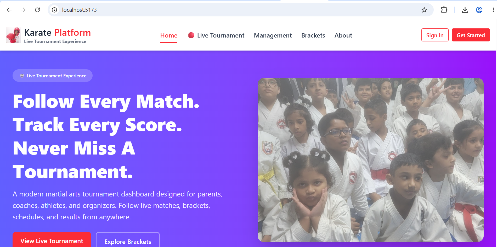
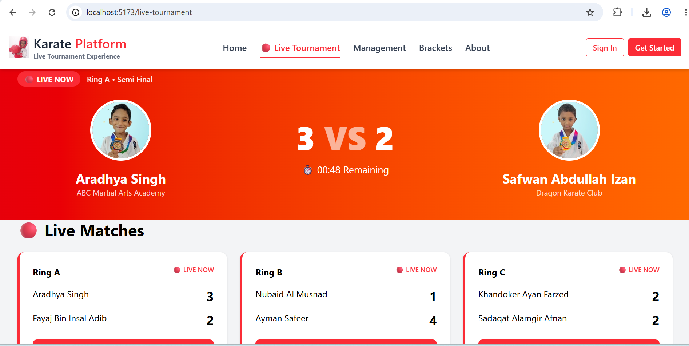
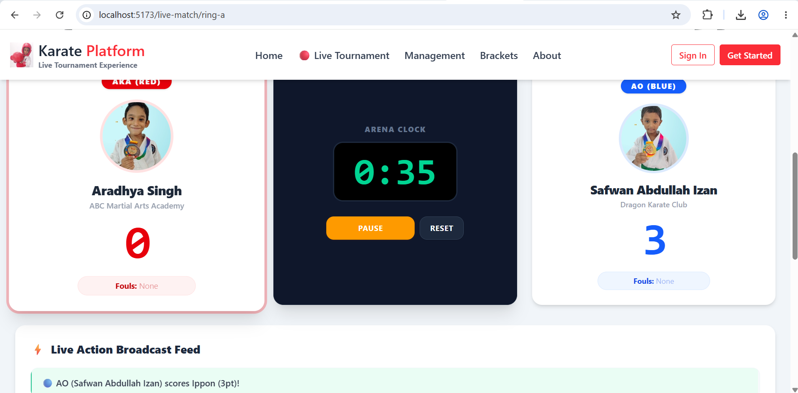
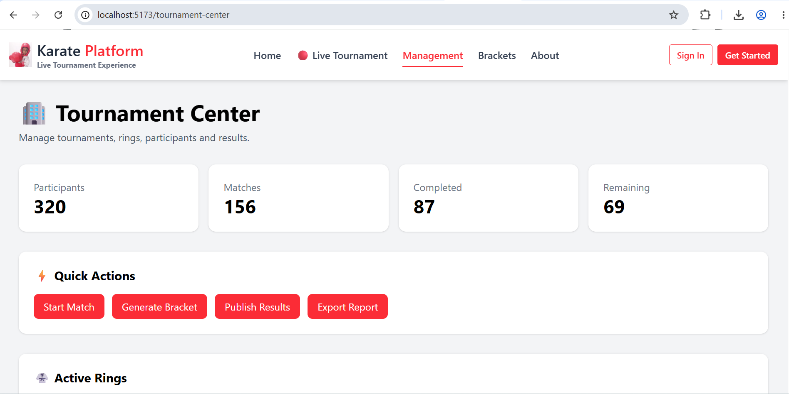
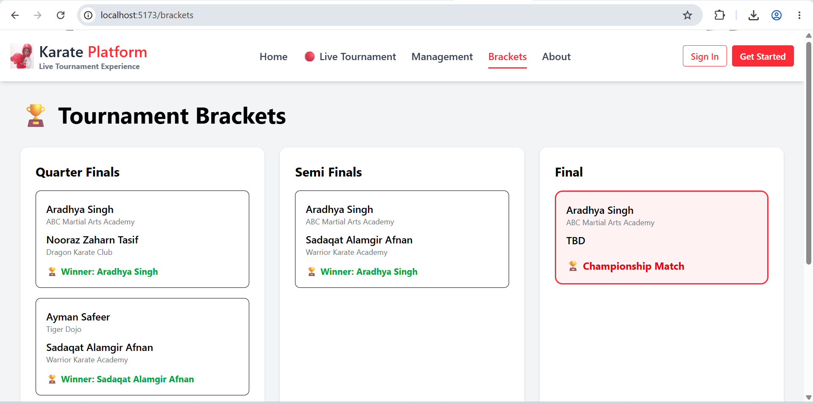

# 🥋 Karate Platform

A modern tournament experience platform designed for martial arts competitions.

Karate Platform helps spectators, athletes, coaches, and organizers stay connected through live match tracking, tournament brackets, real-time scoreboards, and tournament management tools.

---

## Features

### 🔴 Live Tournament Dashboard

* Featured live matches
* Active ring monitoring
* Upcoming matches
* Tournament leaderboard
* Activity feed
* Bracket preview

---

### 🥋 Live Arena

A dedicated match experience for following a specific ring.

* Live scoreboard
* Match timer
* Athlete information
* Foul tracking
* Event feed
* Live stream placeholder

---

### 🏆 Tournament Brackets

* Quarter Finals
* Semi Finals
* Finals
* Athlete progression tracking

---

### 🏢 Tournament Center

Organizer-focused management dashboard.

* Tournament overview
* Ring monitoring
* Match statistics
* Tournament operations

---

## Project Vision

The long-term vision is a complete tournament and dojo management platform for martial arts organizations, including athlete registration, competition management, rankings, examinations, and live event broadcasting.

---

## 📦 Quick Start & Local Setup

et the interactive arena dashboard up and running locally in under a minute:

### 1. Clone the Repository
```bash
git clone [https://github.com/apurba-labs/karate-platform.git](https://github.com/apurba-labs/karate-platform.git)
cd karate-platform
npm install
npm run dev:client

```

Open your browser and navigate to http://localhost:5173 to experience the live arena scoreboard in action.


---

## Technology Stack

* React
* TypeScript
* React Router
* Tailwind CSS

## Current Status

This repository represents a tournament experience prototype focused on solving the presentation and spectator experience of martial arts competitions.

Future development will focus on:

* Real-time WebSocket updates
* Live streaming integration
* Automated bracket generation
* Athlete registration workflows
* Multi-dojo support
* SaaS platform capabilities


---

## Screenshots

### Home Page



### Live Tournament Dashboard



### Live Arena



### Tournament Center



### Brackets



## License

MIT
